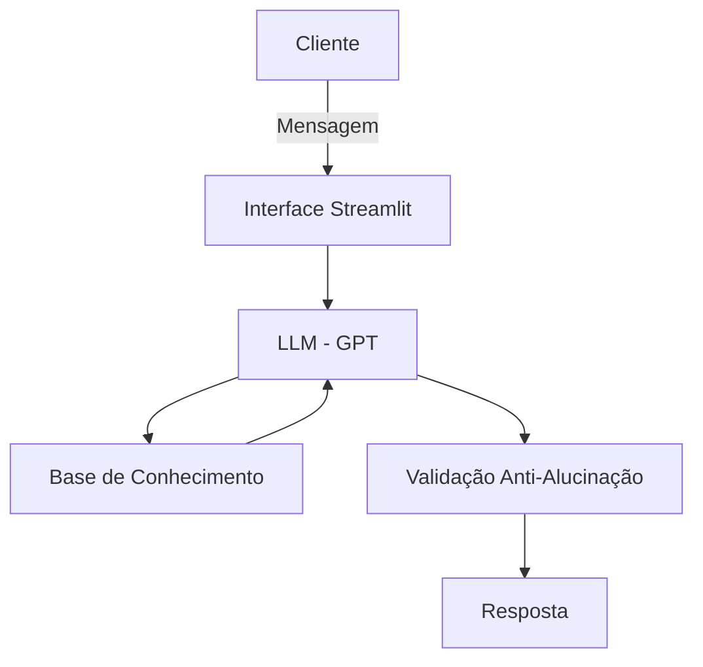

# 🎓 Elo — Educador Financeiro com IA Generativa

> Projeto desenvolvido no Lab "BIA do Futuro" da [DIO](https://dio.me), com o objetivo de criar um agente financeiro inteligente usando IA Generativa.

---

## Sobre o Elo

O **Elo** é um educador financeiro conversacional que ensina conceitos de finanças pessoais de forma simples e personalizada, usando os próprios dados do cliente como exemplos práticos.

Diferente de um consultor de investimentos, o Elo **não recomenda onde investir** — ele explica como as coisas funcionam, no ritmo e linguagem de cada pessoa.

**Problema que resolve:** 62% dos brasileiros não sabem o que é reserva de emergência. O Elo é como ter um professor de finanças disponível 24h, sem julgamentos.

---

## Funcionalidades

- Responde dúvidas sobre finanças pessoais com linguagem acessível
- Usa os dados do cliente (gastos, perfil, histórico) para exemplos concretos
- Explica produtos financeiros sem fazer recomendações diretas
- Admite limitações e nunca inventa informações

---

## Arquitetura



**Stack:** Python · Streamlit · OpenAI API · Pandas

---

## Estrutura do Repositório

```
📁 elo/
├── 📄 README.md
├── 📁 data/                          # Dados mockados do cliente
│   ├── perfil_investidor.json
│   ├── produtos_financeiros.json
│   ├── transacoes.csv
│   └── historico_atendimento.csv
├── 📁 docs/                          # Documentação do projeto
│   ├── 01-documentacao-agente.md
│   ├── 02-base-conhecimento.md
│   ├── 03-prompts.md
│   ├── 04-metricas.md
│   └── 05-pitch.md
└── 📁 src/                           # Código da aplicação
    ├── app.py
    ├── requirements.txt
    └── .env.example
```

---

## Como Rodar

```bash
# 1. Instalar dependências
pip install -r src/requirements.txt

# 2. Configurar a API Key
cp src/.env.example src/.env
# Edite o .env e adicione sua OPENAI_API_KEY

# 3. Rodar a aplicação
streamlit run src/app.py
```

---

## Segurança

O Elo segue princípios rígidos para evitar alucinações:

- Responde **apenas** com base nos dados fornecidos
- **Nunca** recomenda investimentos específicos
- **Não** substitui um profissional certificado (CFP/CFA)
- Admite abertamente quando não tem uma informação

---

## Documentação

| Documento | Descrição |
|-----------|-----------|
| [01 - Agente](docs/01-documentacao-agente.md) | Caso de uso, persona e arquitetura |
| [02 - Base de Conhecimento](docs/02-base-conhecimento.md) | Dados utilizados e estratégia de integração |
| [03 - Prompts](docs/03-prompts.md) | System prompt e exemplos de interação |
| [04 - Métricas](docs/04-metricas.md) | Avaliação de qualidade e assertividade |
| [05 - Pitch](docs/05-pitch.md) | Apresentação da solução |
